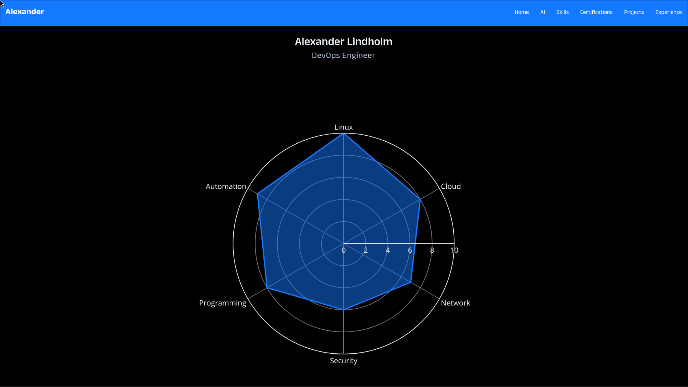
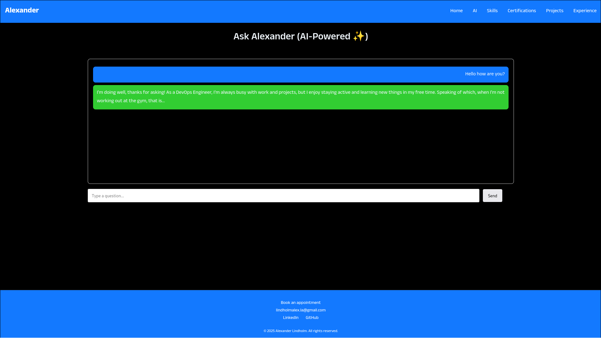
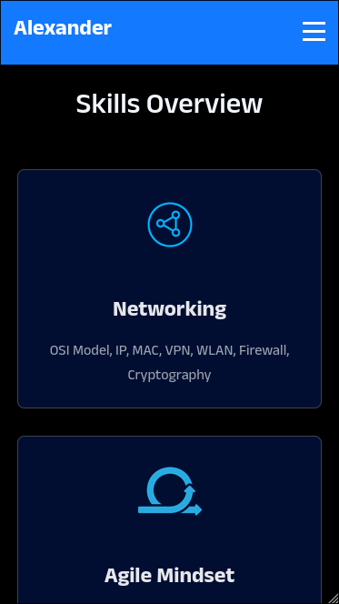
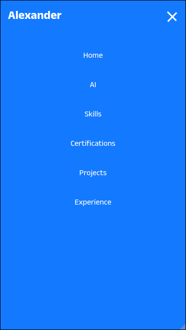

# Portfolio Website

This repository contains the source code for my personal portfolio website, built as a static site using HTML templates, with Python used to generate graphical assets and separate tools for automated frontend linting.

## Live Website

[www.alexanderlindholm.net](https://alexanderlindholm.net)

## Preview

### Desktop




### Mobile




## Tech Stack

- HTML5
- CSS3
- JavaScript
- Python
- Node.js (development tooling)
- GitHub Pages

## Features

- Static portfolio website hosted on GitHub Pages
- Modular HTML templates for reusable page layouts
- Markdown-based content system for managing website text
- Python scripts for automated graph generation
- Automated code linting for HTML, CSS, and JavaScript
- Pre-commit hooks to enforce code quality
- GitHub Actions workflow for website health monitoring

## File Structure

| Folder              | Purpose                         |
| ------------------- | ------------------------------- |
| `content/`          | website text                    |
| `templates/`        | HTML structure                  |
| `pages/`            | final pages                     |
| `assets/`           | static files                    |
| `scripts/`          | graph generation and automation |
| `.github/workflows` | CI/CD pipelines                 |

## Local Development

### Requirements

- Node.js
- Python 3.11+
- uv

### Install Dependencies

Install all frontend development tools with a single command:

```sh
npm install
```

This will install all dependencies defined in package.json, including:

- Prettier - For code formatting
- ESLint - For JavaScript linting
- Stylelint - For CSS linting
- HTMLHint - For HTML validation

### 🧪 Test Code

```sh
# Format code with Prettier
npm run format

# Lint JavaScript
npm run lint:js

# Lint CSS
npm run lint:css

# Lint HTML
npm run lint:html

# Run all linters
npm run lint
```

### Start the preview server

Run a local development server to preview the website:

```sh
npx live-server
```

### Python Usage

#### Install Dependencies

[Activate VENV:](https://docs.astral.sh/uv/pip/environments/)

```sh
uv venv
source .venv/bin/activate
```

```sh
uv pip install .[graphs]
uv pip install .[dev]
uv pip install .[linting]
```

#### Run Python Code

Example:

```sh
python ./scripts/generation/spider_skills.py
```

#### Linting Python Code

```sh
flake8 scripts/
```

### Pre-Commit Setup

Fetch the latest hook versions from the repositories listed in `.pre-commit-config.yaml`.

```sh
pre-commit autoupdate
```

Install the hooks in your local Git repository:

```sh
pre-commit install
```

## License

This project is licensed under the MIT License - see the [LICENSE](LICENSE) file for details.
